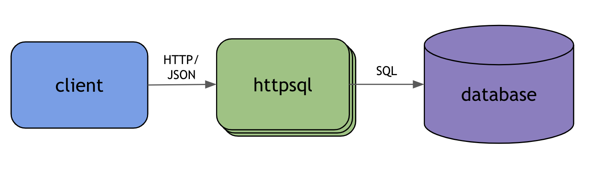
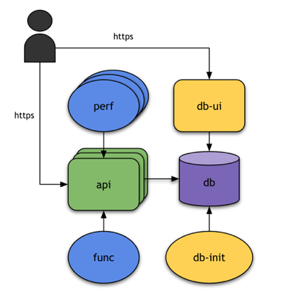

### Overview
*httpsql* is an application that offers a RESTful interface for querying and managing data in a (SQL) database.
It works by accepting JSON over HTTP and translating it to SQL to run against a database.


### Benefits
- Underlying database(s) is abstracted from clients so it can more easily be changed
- Clients do not have to install and maintain libraries to interact with specific databases
- Centralized control/visibility by handling all requests through a common API layer, including
  - monitoring of request metrics
  - authentication/authorization
- Developers just interact with the more familiar and native HTTP and JSON, instead of SQL

## Usage

### Example
Let's run through an example with a simple *students* table that includes the fields **name**, **grade**, and **ID**.

The following JSON `POST`ed to `/tables/manage/students`
```json
{
  "fields": {
    "id": "int", 
    "name": "string", 
    "grade": "int"
  },
  "key": "id"
}
```
would be translated into the following SQL and executed to create the *students* table.
```sql
CREATE TABLE students(
  id INT PRIMARY KEY, 
  name VARCHAR, 
  grade INT
)
```
The following `POST`ed to `/tables/students` would insert data into the table.
```json
[
  {"id": 1, "name": "Rick Sanchez", "grade": 10}, 
  {"id": 2, "name": "Morty Smith", "grade": 9}
]
```
A `GET` on `/tables/students` would return all entries in the table (as JSON),
and lastly a `DELETE` on `/tables/manage/students` would delete the *students* table.

For more example commands, see the [functional test](tests/func/run.sh) that exercises the API.

### Additional Notes
#### Supported Field Types
The following table describes the field types that can be specified when creating tables.

Type in *httpsql* | Translation in SQL
--- | ---
`int` | `INT`
`string` | `VARCHAR`
`boolean` | `BOOLEAN`

#### No op
Any request that sets the query parameter `no_op=true` will simply return the translated SQL command instead of executing it.

## Deployment

*httpsql* is easily deployed using Docker.

With this repository cloned, build the `api` container with the following command.
```sh
docker build -t httpsql-api .
```

Run a database that the `api` container can connect to.
```sh
docker run --name httpsql-db postgres
```

In a new terminal window, run the following to observe the IP address for the database.
```sh
docker inspect httpsql-db | grep IPAddress
```

Run the `api` container with the following, replacing `[db-ip]` with the observed IP address of the database.
```sh
docker run -e "DB_HOST=[db-ip]" -p 8080:8080 httpsql-api
```

If successful, the *httpsql* API will become available on <http://localhost:8080>.

>If you run Docker on a different machine (e.g. another VM), `localhost` will have to be replaced 
with this machine's hostname or IP.

## Configuration

### General
The following table describes the environment variables that can be used to configure *httpsql*.

Variable | Description | Default
--- | --- | ---
`DB_PROVIDER` | The database provider to use (`postgres`, `cassandra`) | `postgres`
`DB_HOST` | The hostname (or IP) of the database to connect to | `db`
`DB_PORT` | The port of the database to connect to | `5432` for `postgres`, `9042` for `cassandra`, etc.
`DB_USER` | User to use to authenticate to database | `None`
`DB_PASS` | Password to use to authenticate to database | `None`
`DEBUG` | Set this to `true` to enable debug logging | `false`

>Support for `cassandra` is experimental and requires uncommenting the line in the Dockerfile
that installs the related driver prior to building the container.

### Clustering
*httpsql* is easily clustered by simply running multiple copies of it.

## Development

*httpsql* is developed and tested using the following architecture. It runs on Aramse's **f8** platform, which provides 
it CI/CD, monitoring, and more for all branches out-of-the-box through a simple configuration file that describes this 
architecture. If you're interested in a short demo of onboarding *httpsql* to f8, please contact <sales@aramse.io>.



Name | Type | Purpose
--- | --- | ---
api | stateless component | (The main piece) handles http requests, converts them into SQL, and runs them against **db**
db | stateful component | provides the database (using `postgres` Dockerhub image)
db-init | init component | creates a schema in **db**
db-ui | stateless component | provides a UI to view the contents of **db** (using `pgweb` Dockerhub image)
func | test | tests the functionality of **api**
perf | test | tests the performance of **api**


